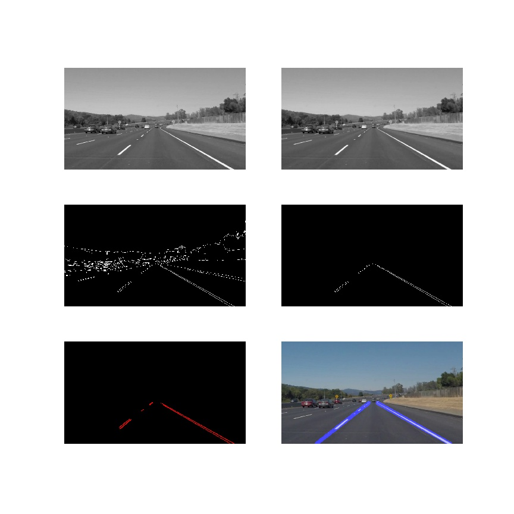
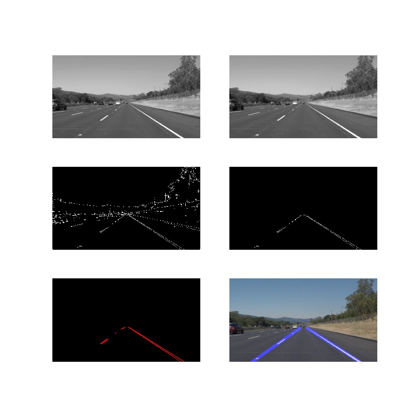
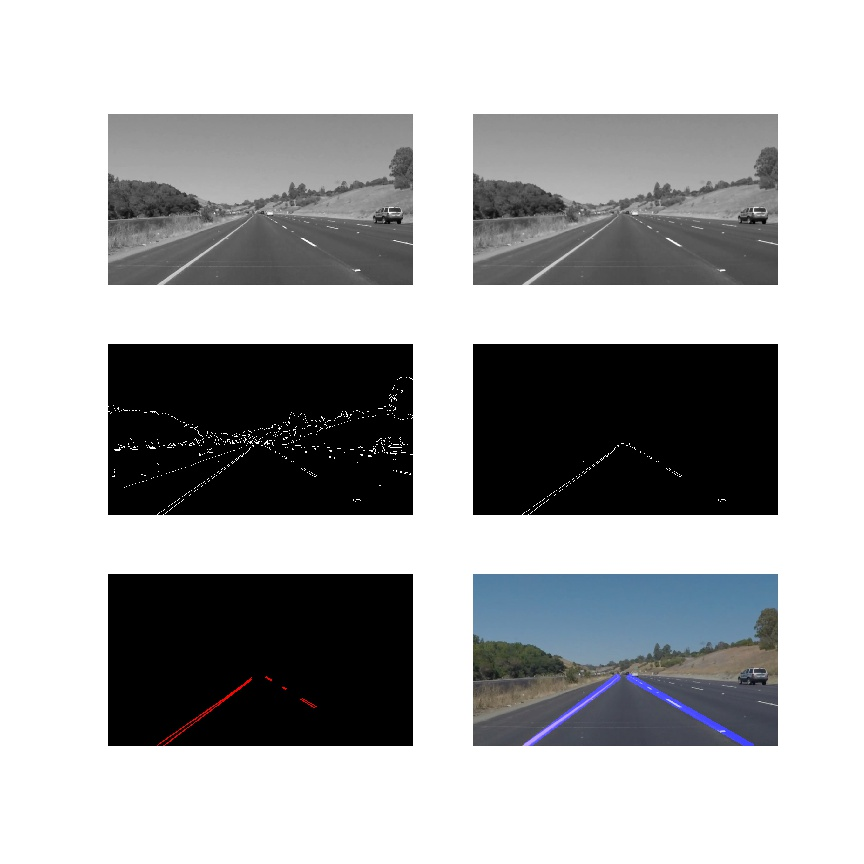
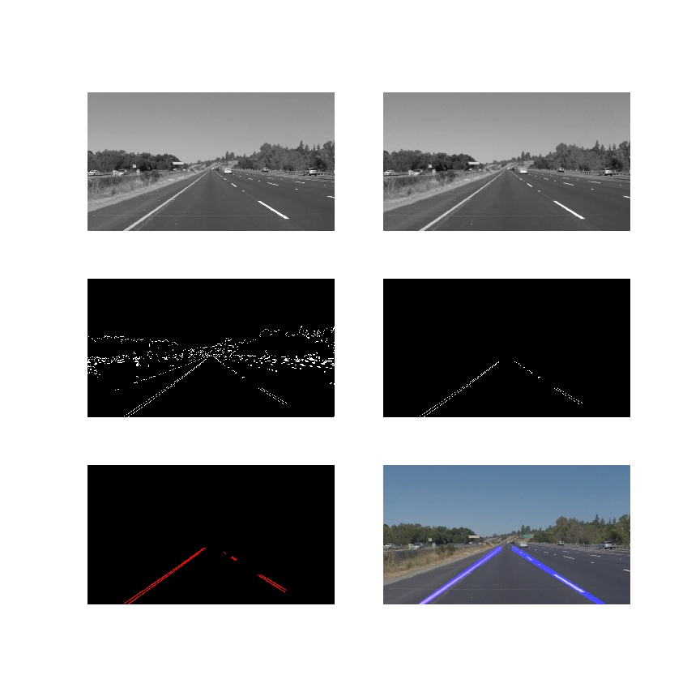
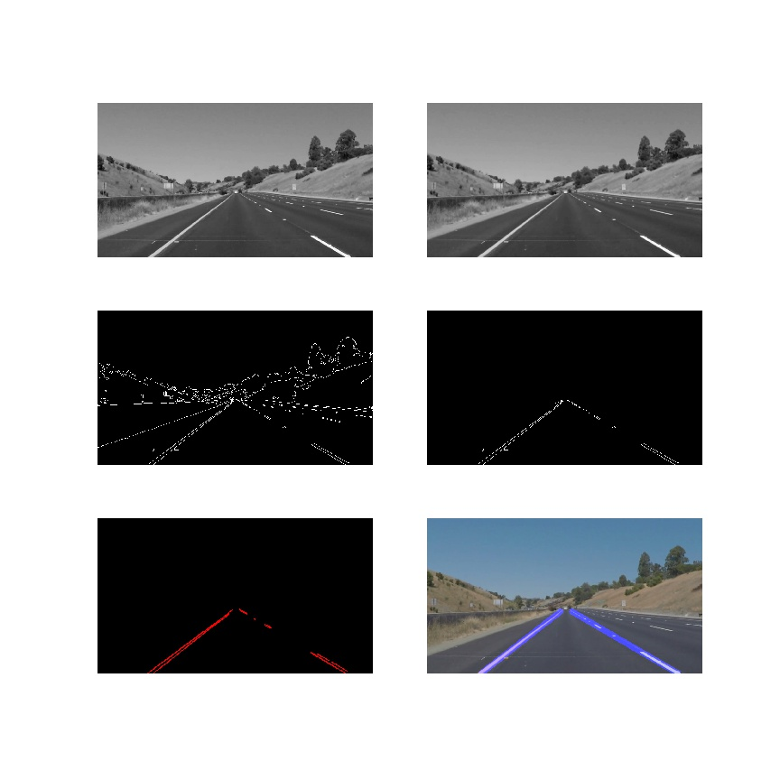

# **Finding Lane Lines on the Road** 

---

**Finding Lane Lines on the Road**

The goals / steps of this project are the following:
* Make a pipeline that finds lane lines on the road
* Reflect on your work in a written report

[//]: # (Image References)

[image1]: ./examples/grayscale.jpg "Grayscale"

---

### Reflection

### 1. Describe your pipeline. 

My pipeline consisted of 5 steps:
* Convert the image to grayscale
* Apply a Gaussian Noise kernel
* Apply the Canny transform
* Crop useful data considering the region of interest
* Detect lines using the Hough Line Transform

First, images are converted to grayscale in order to apply the canny trasform, which computes the gradient of the image and, so, it is able to detect the edges. This image is cropped using a region of interest where lines are found using the Hogh Line Trasform.

In order to draw a single line on the left and right lanes, I modified the hough_lines() function so that it provides just the detected lines. In addition, a new function has been defined in order to compute the parameters to create the extrapolated left and right lines. 

The procedure carried out to compute the extrapolated lines is defined below:
* Compute slopes and center of the lines
* Separate lines considering the slope value
* Compute average values for the slope and center of each line
* Create the right and left lines with the computed values

Below the pipeline is applied to several images.

### Solid white curve 

### Solid white Right 

### Solid yellow curve 

### Solid yellow curve 2

### Solid yellow left 

### Solid Car Lane Switch 

### 2. Potential shortcomings with this pipeline

One potential shortcoming would be what would happen when lanes have a considerable curvature. In this situation, unnecessary data will be considered due to the definition of our region of interest.

Another drawback will be found when going through a steep road, given that the extrapolated lanes are defined up to the middle of the image.

### 3. Possible improvements to my pipeline
Several improvements could be carried out in order to improve inappropriate behaviours. For example, detection of curved lines will be useful when driving on curved road. In addition, considering the horizon will improve the system functionality when driving on steep road.

